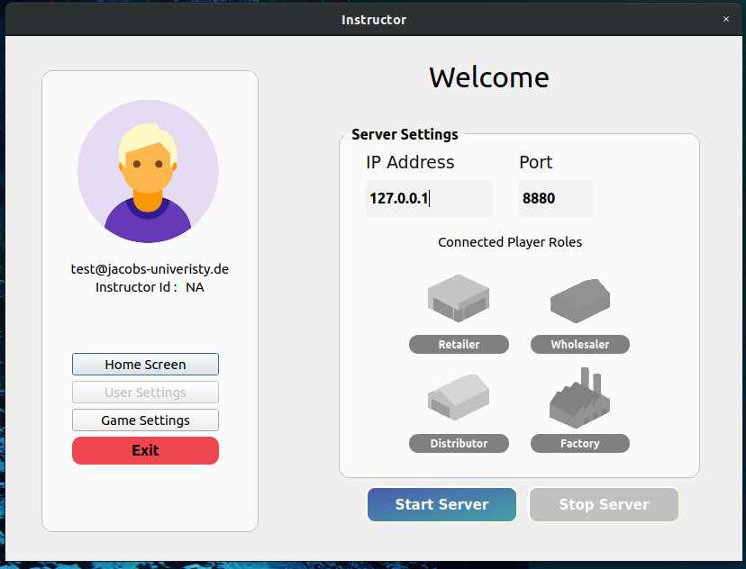
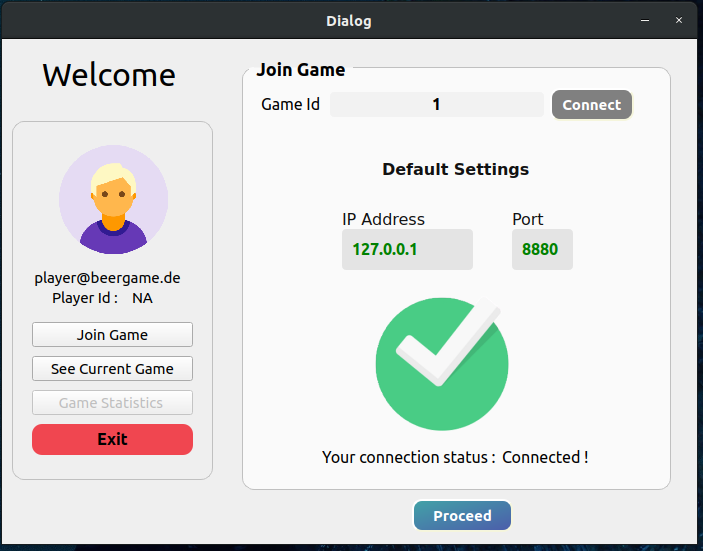
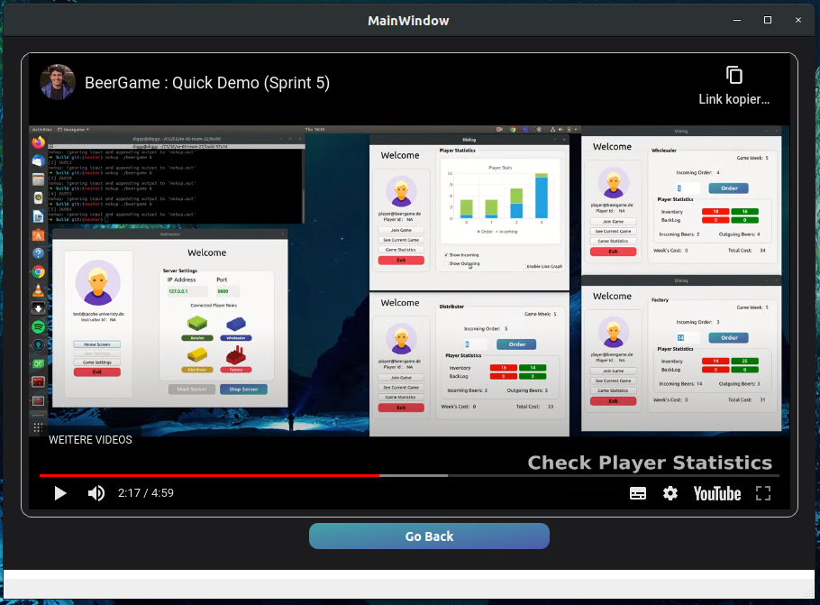
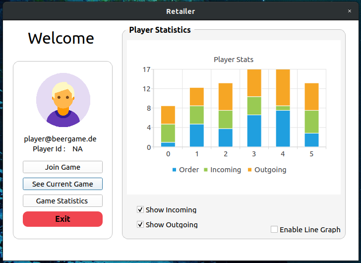
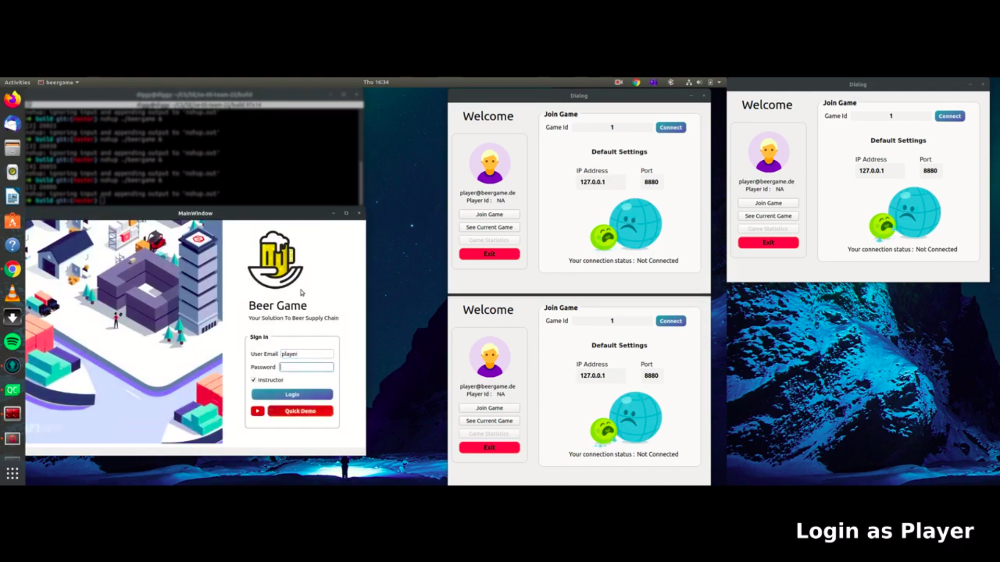

#   Beer Game 🍻

[](https://GitHub.com/Naereen/StrapDown.js/releases/)


## Table of Contents

* [About the Project](#about-the-project)
    * [Built with](#built-with)
* [Screenshots](#screenshots)
* [Getting Started](#getting-started)
    * [Prerequisites](#prerequisites)
    * [Installation](#installation)
    * [Run the app](#run-the-app)
    * [Run the tests](#run-the-tests)
* [Current UI Guide](#current-ui-guide)
* [Contributing](#contributing)
* [License](#license)
* [Contact](#contact)
* [Credits](#credits)

## About the Project
The beer game is an online game intended for students to better understand how supply chain works in a real world situation, applying the theory learned in class and practicing decision making. Therefore it is a functional type of game. This project simulates the way beer is being ordered and delivered from production and factory, going to distributor, then wholesaler and then to retailer and consumer. Each of these stages can be played by the students who, order enough beer stock in the position they hold, taking into consideration shipment times, delays, backorders, inventory such that, every partner in this chain doesn’t suffer any losses.

### Built with
* [C++](http://www.cplusplus.com)
* [Qt Creator](https://www.qt.io/download)
* [CMake](https://cmake.org/cmake-tutorial)
* [Doxygen](http://www.doxygen.nl/manual/starting.html)
* [Google Test](https://github.com/janoszen/clion-project-stub/blob/master/gtests/googletest/docs/Primer.md)

## Getting Started

These instructions will get you a copy of the project up and running on your local machine for development and testing purposes.

## Getting started

What things you need to install the software and how to install them

### Prerequisites
* Qt5 SDK
```sh
brew install qt5
```
* GTest

Installion on Linux
```sh
sudo apt-get install libgtest-dev
```

Installation on Mac
```sh
brew install libgtest-dev
```

### Installation
Clone the repo
```sh
git clone https://github.com/iuliacornea99/se-05-team-22
```

### Run the app
```sh
cd build
cmake .. -DCMAKE_PREFIX_PATH=$(brew --prefix qt5)
make
cd src
./beergame
```

### Run the tests
```sh
cd build
cmake .. -DCMAKE_PREFIX_PATH=$(brew --prefix qt5)
make
cd tests
./beergame-test
```

You have to set your Qt location in CMakeLists if it doesn't work via set(CMAKE_PREFIX_PATH PATH_TO_QT)

### To make docs 
The documentation is automatically generated when we run `make` after `cmake ..`.

and then the documentation can be found within the directory `doc` that is inside build.

## Current UI Guide

Currently a login ui has been implement where :

For Instructor:
```
User Email : instructor
Password   : 123
Instructor : ✅ (True)
```
For Player: 
```
User Email : player
Password   : 123
Instructor : (Not ticked : False)
```
(Currently we dont have an authentication mechanism.)

## User Guide
If you want to run the server and the client individually then after you build the project:

### Server
To run server :
```
cd build/src/server
./beergame-server
```
### Client
To run client :
```
cd build/src/client
./beergame-client
```

## Milestones/Features Added 

* [x] Implemented Network based game with instructor creating a server where players join as client.

* [x] Implemented Graphing function for Network based client.

* [x] Added an window icon for the game.

* [x] Fix the **numerous** compilation errors from the previous codebase.

* [x] Added the statistics/graphs functionalities for player.

* [x] Added test cases in `tests.cpp` for all functionalities. 

* [x] Added an Extensive Demo It in youtube for User convenience to the software.

* [x] Refactored the Game logic for all classes.

* [x] Inhance the UI and add the window icon.


#### Server & Client  :
 
 



## Contributing

Contributions are what make the open source community such an amazing place to be learn, inspire, and create. Any contributions you make are **greatly appreciated**.

1. Fork the Project
2. Create your Feature Branch (`git checkout -b feature/AmazingFeature`)
3. Commit your Changes (`git commit -m 'Add some AmazingFeature`)
4. Push to the Branch (`git push origin feature/AmazingFeature`)
5. Open a Pull Request
        
## Acknowledgments

* Software engineering Teaching Assistants
